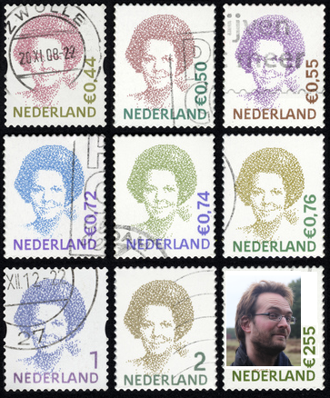

# Ik Zing Alleen Voor De Koningin

Branch|
---|---
master|

Richel Bilderbeek's 7th music CD.

Name|OGG|MP3|YouTube|MP4
---|---|---|---|---
[Stuk Eiwit](https://github.com/richelbilderbeek/music/blob/master/StukEiwit.md) |[here](CD07_StukEiwit20070930.ogg)|[here](CD07_StukEiwit20070930.mp3)| . | .
[Organellenwals](https://github.com/richelbilderbeek/music/blob/master/Organellenwals.md) | [here](CD07_Organellenwals.ogg)| [here](CD07_Organellenwals.mp3)| . | . 
[Ben Ik Een Spin](https://github.com/richelbilderbeek/music/blob/master/BenIkEenSpin.md) | [here](CD07_BenIkEenSpin20070610.ogg) [here](CD07_BenIkEenSpin20180227.ogg) | [here](CD07_BenIkEenSpin20070610.mp3)| [here](https://youtu.be/TWnNQejBlHw) | [here](CD07_BenIkEenSpin20180227.mp4) 
[Heejaa Mama](https://github.com/richelbilderbeek/music/blob/master/HeejaaMama.md) | [here](CD07_HeejaaMama20180317.ogg) | . | . | .
[Voor De Klas](https://github.com/richelbilderbeek/music/blob/master/VoorDeKlas.md) | [here](CD07_VoorDeKlas20101211.ogg) | [here](CD07_VoorDeKlas20101211.mp3)| . | . 
[Vrouwen Van Je Dromen](https://github.com/richelbilderbeek/music/blob/master/VrouwenVanJeDromen.md) | [here](CD07_VrouwenVanJeDromen20180317.ogg) | . | . | . 
["Friday"](https://github.com/richelbilderbeek/music/blob/master/Friday.md) | [here](CD07_Friday20110812.ogg) | [here](CD07_Friday20110812.mp3)| . | .
[Groningen Danst](https://github.com/richelbilderbeek/music/blob/master/GroningenDanst.md) | [here](CD07_GroningenDanst20120805.ogg) | [here](CD07_GroningenDanst20120805.mp3)| . | .
[Superman B](https://github.com/richelbilderbeek/music/blob/master/SupermanB.md) | [here](CD07_SupermanB20130621.ogg) | [here](CD07_SupermanB20130621.mp3)| . | . 
[Hee Ga Je Mee](https://github.com/richelbilderbeek/music/blob/master/HeeGaJeMee.md) | [here](CD07_HeeGaJeMee20130622.ogg) | [here](CD07_HeeGaJeMee20130622.mp3) | [here](https://youtu.be/MJfnb_Oo0Ok) | [here](CD07_HeeGaJeMee20130622.mp4)
[Monsier Pannetier](https://github.com/richelbilderbeek/music/blob/master/MonsieurPannetier.md) | . | . | . | [here](monsieur_pannetier.mp4)
Duizend Bier (instrumental) | [here](CD07_DuizendBier20110205.mp3) | . | . | .
[Pjanoman](https://github.com/richelbilderbeek/music/blob/master/Pjanoman.md) | [here](CD07_Pjanoman20180227.ogg) | . | [here](https://youtu.be/f790a18Ngv0) | [here](CD07_Pjanoman20180227.mp4)
Santa Claus Is Coming To Town (instrumental) | [here](CD07_SantaClausIsComingToTown20180227.ogg) | . | . | . 
[Liefdeskapitein](https://github.com/richelbilderbeek/music/blob/master/Liefdeskapitein.md) | [here](CD07_Liefdeskapitein20180228.ogg) | . | . | . 
[Een](https://github.com/richelbilderbeek/music/blob/master/Een.md) | [here](CD07_Een20180228.ogg) | . | . | . 
[16777216 Kleuren](https://github.com/richelbilderbeek/music/blob/master/16777216Kleuren.md) | [here](CD07_16777216Kleuren20180317.ogg) | . | [here](https://youtu.be/fkbAa7Ao0Y0)  | [here](CD07_16777216Kleuren_20170304.mp4)
[Het Leven Is Naar](https://github.com/richelbilderbeek/music/blob/master/HetLevenIsNaar.md) | [here](CD07_HetLevenIsNaar20180317.ogg) | . | [here](https://youtu.be/vCnuWdDL1Hs) | [here](CD07_HetLevenIsNaar20180317.mp4)
[Wooloo Mooloo](https://github.com/richelbilderbeek/music/blob/master/WoolooMooloo.md) | [here](CD07_WoolooMooloo20180317.ogg) | . | [here](https://youtu.be/0fL1qSbjmSw) | [here](CD07_WoolooMooloo20180316.mp4)  
[Morgenvroeg](https://github.com/richelbilderbeek/music/blob/master/Morgenvroeg.md) | [here](CD07_Morgenvroeg20180317.ogg) | . | . | . 

## Raw material

 * [Hee Goade Mee (instrumental)(2013-04-05)(ogg)](CD07_HeeGoadeMee20130405.ogg)
 * [Heyah Mama (poet edition)(2013-04-05)(ogg)](CD07_HeyahMama20130405.ogg)
 * [Heyah Mama, wrong heart (2013-04-05)(ogg)](CD07_HeyahMama20130405VerkeerdeHart.ogg)
 * [Superman B (instrumental, verses only)(2013-04-30)(ogg)](CD07_SupermanB20130430_1.ogg)
 * [Superman B (instrumental)(2013-04-30)(ogg)](CD07_SupermanB20130430_2.ogg)
 * [Superman B (instrumental, chorus only)(2013-04-30)(ogg)](CD07_SupermanB20130430_3.ogg)
